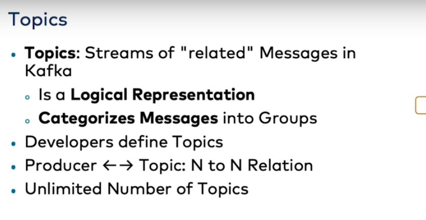

* decoupling of data streams and systems
* for a single company or system we have source system and the target system client side and the server side
* 

the format is :

real world events( iot , insurances , logistics shipping ) -> producer(application that we write ) -> kafka cluster( made up of brokers)

brokers can be anything (container , vms , machines )
with their own local storage

glossary terms:
* producer:
* consumer:
* broker:
* topic:
* zookeper:

topic:

topic partition and segments

