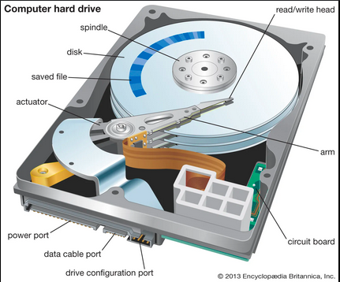
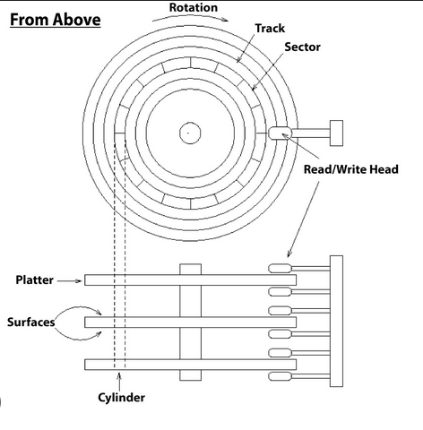
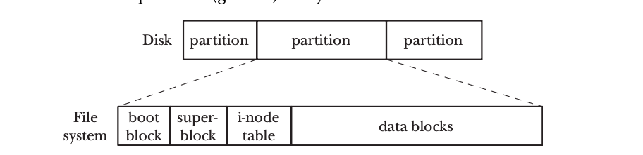
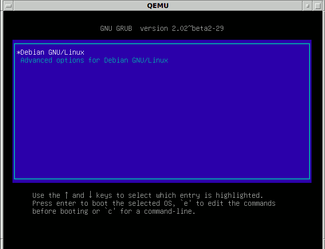

To understand the boot process of linux we first should be familiar with some hardware components that constitute a PC. Let's  dive deep into the structure of disk drive.
#### Hard Disk Drive
 formerly, disk and drive were two different components. Disk is where the data is stored whereas drive is a part that moves or directs the seeker or pointer to the specific sector.

The arm contains the read/write head which writes the data in block on the sector. The circular component is platter that rotates at high speed and each platter is fitted with each arm. To understand where the data is actually stored we need to understand the concept of track and sectors.
The concentric rings on the platters are called tracks and each tracks are further divided into sectors where the actual data is stored. Data is stored in block of size 512 bytes. The first sector on track 0 is where the Master Boot Record (MBR) is stored on MBR Based system. The newer system with more advanced features is  GUID Partition Table (GUID). I will use the MBR to explain the boot process in this section. However, I will explain the GPT later.

### Reading And Writing Information To The Disk
Writing information to the disk takes significant amount of time. It is due to the fact that the disk head or the arm has to move to the appropriate tracks and sectors to carry out the read and write operation. The seek time is the time taken by the the disk head to seek the appropriate track and the transfer time is the time taken to transfer the data blocks. On top of that there is also rotational latency which is time taken by platter to rotate.

### How does Linux Treat The Disk
Typically there are two types of devices in Linux System. They are character devices and Block Devices. The character devices can input one character at a time. For example: Mouse, Keyboard, terminal. Block devices store the data in blocks. For example: hard disk. These device files are stored on the /dev directory. Furthermore each partition of the disk are also stored as separate file on /dev directory. Each device has their own device driver which is facilitated by the Linux Kernel through API. The System Calls powered  by the device drivers are open(), close(), read(), write(), ioctl(), mmap(). Each device has an identifier called Major and Minor ID number which is used by the kernel to look up the appropriate device driver.

### Disk Partition
Disk partition is a logical division of the hard disk where the actual filesystem reside. MBR and GPT system has it's own specification on how many partitions are supported. A disk partition may consist of filesystem, swap area and data area.

### File System
File system is an organized collection of directories and files. There are different file systems available. example include microsoft's FAT and NTFS, journaling filesystems
-> BTRFS, XFS. 

As we can see a disk is divided into multiple partitions. Each partition can hold a filesystem. File system consist of boot block , super block, i-node table and the data block. A boot block stores the boot code and  is present on all the partitions although the partition is not bootable. i-node is the most important element. To clarify, when we double click on the GUI based directory on Linux system. It uses the i-node entry to identify if we are authorized to and also expands into the files present on the directory. Each partition holds it's own i-node entry. Super Block contains information such as size of i-node table, size of logical blocks and size of data blocks in a file system. The data blocks is where the actual block of data is stored.

### Combining Everything Now
The boot process initiates with us clicking the power button which is followed by the BIOS (Basic input output system) which is burned in  the ROM and the PC is hardwired to load the BIOS which further runs the Power On Self Test (POST). It does a hardware checking to identify the flaws and the I/0 connectivity on the system. BIOS then loads the MBR from the disk( I have already explained where MBR is stored). MBR consists of disk signature, partition table and the master boot code. The disk signature identifies which disk is bootable out of possible multiple disks on the Linux system. Partition table identifies how partition is laid out on disk. The master boot code works independently to load the bootloader on to the memory. After the identification of valid bootable disk the boot code executes the task of loading the bootloader -> GRUB2 into the  memory.

The GRUB bootloader loads the compressed kernel image vimlinuz file which is stored on /boot directory into the RAM. The kernel takes over after this and starts the systemd which is process with PID of 1 which is the parent of all the process in a linux system. Systemd performs all the initialization task like setting machine name and initializing network and more. Formerly Sysvinit or init was used which has been replaced by modern Systemd. Before runlevels was used to identify how the OS is to be used. for example like in single user mode, multi user or graphical mode. Now it is defined in terms of targets.
example:
- runlevel 0 -> poweroff.target
- runlevel 3 -> multiuser.target
- runlevel 5 -> graphical.targe
I skipped some runlevels. After the runlevel scripts or target scripts is run and if everything goes fine we are prompted with login screen

