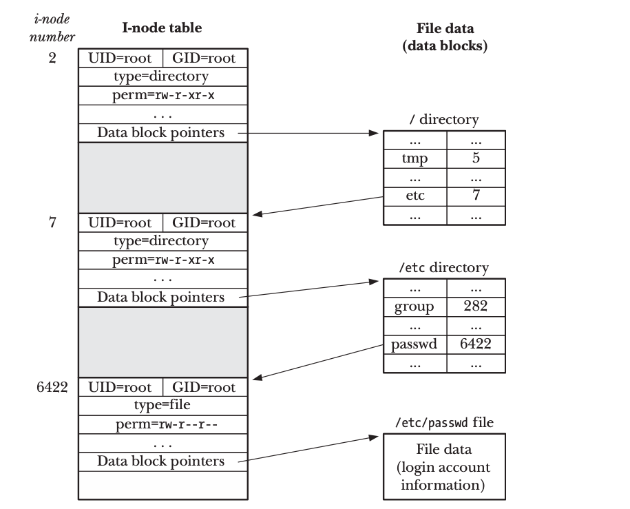
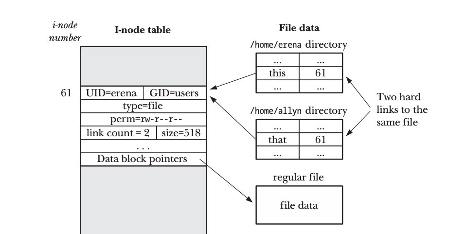

Each partitions on a Filesystem has an i-node table which contains information about the files and directories. In the previous 'boot process of Linux' document I briefly mentioned about the partitions and it's constituents. I am only going to discuss about the super block here. One of the function of a super block is  storing the size of the i-node table. The super block also contains the location of the inode for / (root) directory.
An inode table consists of the following information:

* File type (directory, file, symbolic link)
* Owner (also UID of the file)
* Group (also GID of the file)
* Access permissions for owner, group and others
* Timestamps (time of last access)
* Number of hardlinks to a file
* Size of file in bytes
* pointers to the data blocks of the file


### In-depth Understanding 
I will take above figure as a reference to analyze inode in depth. Here we are looking at the inode entry of /etc/passwd file. This file stores the user's login information such as user's name, gid, uid, login shell. To reach passwd file / (root) needs to be accessed and it has it's own separate inode entry. / is determined from the super block itself. The inode information for the / such as permission, type, uid and gid is used by the underlying C programming to determine if we can access it. If so / which is a directory in itself has the inode pointer to the /etc (7 here). Now the process is repeated for /etc which has the passwd file and it's  pointer (6422 here). Using the pointer of passwd /etc/passwd file is accessed.

**Note: An inode does not store name of directories and files.** 

### Understanding Of Directory File
Directories are special files that are used to create and hold access paths to the files in the file system. It consists of the directory name, inode, length of the directory entry in bytes. Above figure shows the two directory file /etc and /.
[Link to the reference](https://tldp.org/LDP/tlk/fs/filesystem.html#tth_sEc9.1.4)


### Hard Link
Each directories and files on a Linux system has a filename. The directory name is stored in the directory file which also has the inode of that directory. Inode does not store the name of directories and files. This results to a useful consequence that we can create multiple name in same or in different directories labeled as link or hard link in this case. The hardlink points to the same inode entry. Let's say I create a hard link of file labeled foo which is bar. I will get back to the creation of hard link in terminal later. Now the files foo and bar point to the same inode entry. If one of the files is removed other still continue to exist and the link count increases by one. 
Hardlink has several limitations:
- cannot be created on directory (causes circular links)
- is unique to a single file system since the inode is only unique to a single filesystem.


### In-depth Understanding using I-node table
In the figure above we have a file named this. We now create the hardlink of the file which is labeled that. Now as you can see it both points to the same inode pointer 61 which is the actual location of the file data.

### Symbolic link Or Soft Link
Symbolic link does not create direct link to the inode table. Instead Symbolic link uses the filename to create the link 

Let's break down the above figure into bits. We first create a symbolic link to the file /home/kiran/other which points to inode pointer 309 which points to the data /home/erena/this. Here "other" is a symbolic link to the name "this". Here link count does not increase unlike hard link where link count increases. Also symbolic link solves the limitations of hard link. Symbolic link can be created on directory and also on multiple filesystem.

### Where Are They Used?
Hard links can be used during backup and recovery process. Creating multiple links to the sensitive file can prevent accidental deletion of file. It is also used for efficient storage where multiple file points to the same data saving disk space.

On the other hand soft links can be used to create a shortcut to a file. It can also be used for cross filesystem referencing since inode is not used.


### Creating  Links
ln command is used to create both hard and soft links.

##### creating hard link
```
ln /path/to/original/file /path/to/hardlink

```

##### creating soft link
```
ln -s /path/to/original/file /path/to/softlink
```
