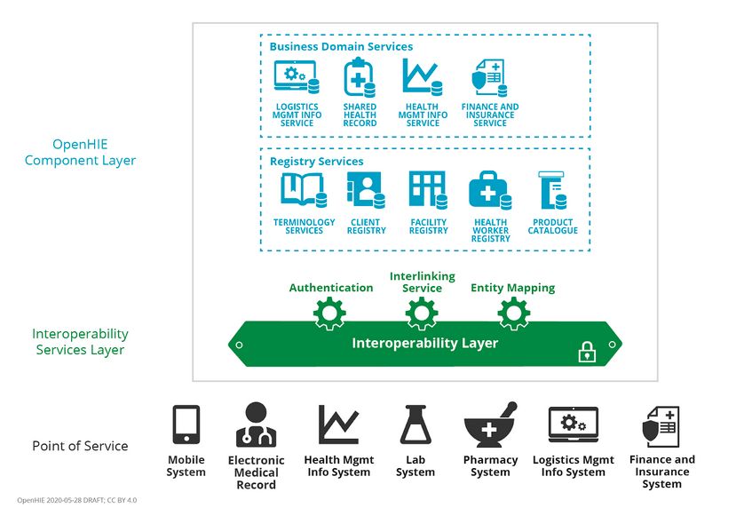
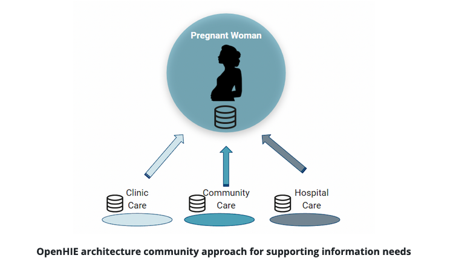
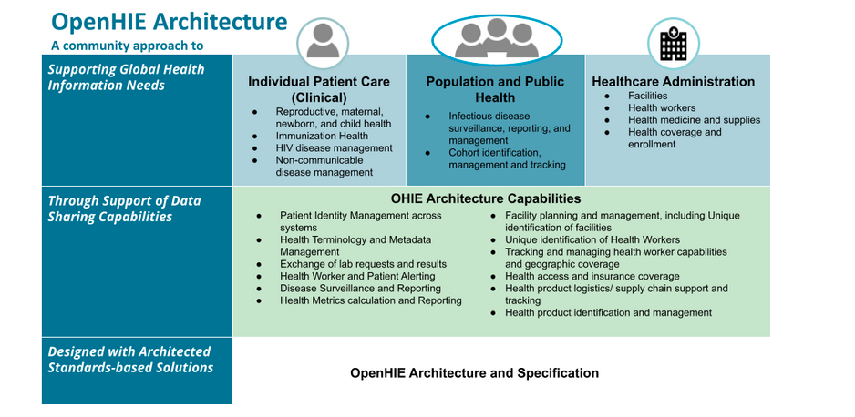
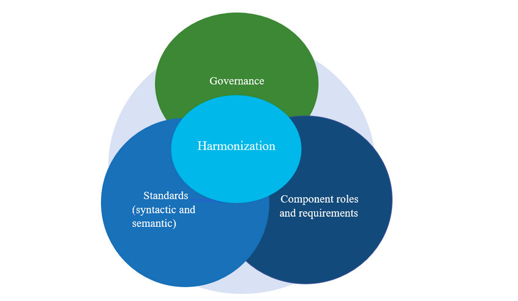
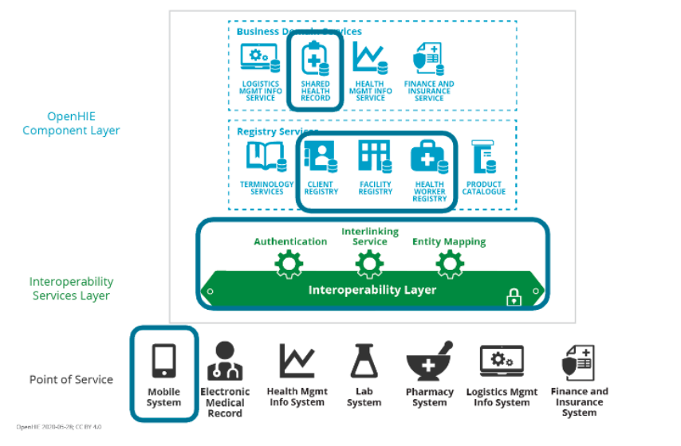

 community of people building an open framework to support nations as they develop health information exchanges (HIEs) to improve patient care, public health, and the management of health resources
## course 1 : introduction to HIE :

### why is HIE important?
Typically health data is captured at a point-of-care or point-of-service system like an EMR or a Lab system.
A blueprint or strategy for the different components that are needed to effectively categorize and use health data, begins to outline the structure that enables disparate systems to share and exchange data that can support effective use of health data to serve patients, population health and help plan for and utilize health resources.

### what is HIE?
Health information exchange (HIE) is the exchange of healthcare information electronically across organizations within a hospital system, region, or country.

- Provides the capability to electronically transfer clinical information among different health care information systems.
- It makes the sharing of health data across information systems possible
- Normalizes data and secures the transmission of health information throughout databases, between facilities, and across regions or countries.

#### architecture:

another example:

### so that was HIE.now what exactly is openHIE?
OpenHIE is an open community of practice with participation from anyone who desires to contribute. 
example lists:

   - Ministries of Health (MoH)/ Government/ National bodies, 
   - Implementers and software creators,
   - Funders, 
   - Domain experts/technical experts, 
   - Developers wanting to adopt and implement OpenHIE Standards, 
   - End users/Health Care Team,

### some glossary terms:

* interoperability:
    The ability of computer systems or software to exchange and make use of information
  
* standardization:
    **Semantic** “word” standards: Country established or internationally established (ICD10, SNOMED)**.** 
     - Colour and Color
     - BP and Blood Pressure
     - Coding and terminology sets

- harmonization:

- Point of service:
    Point-of-service applications are used by clinicians and by community health workers to access and update a patient’s person-centric shared health information and to record healthcare transactions.

- Business Domain Services:
    Business Domain Services are Health Exchange components that are designed to support specific health system business domains and would have the potential to combine data Health Exchange data from multiple point-of-care systems.

- Registry Services:
    Registry Services are Health Exchange Components that are designed to support registries with data that is used by other Health Exchange components.

### USE CASE example self explanatory:

  ram(an HIV patient) is registered at HealthPost  ---> his data  is recorded by EMR(electronic medical records ) fig_below --> forwarded to interoperable system (after authentication) --->client registry is checked to match demographic data and create link with other records --->local EMR is shared with SHR (shared record) 
   
use case scenario
   ram experiences bleeding ---> his neighbor reports it to the health app ---> found anemic and flagged urgent and recorded on SHR ---> days later ram has not gone to hospital ---> health app sends notification to neighbor ---> ram is taken to health care.
   

