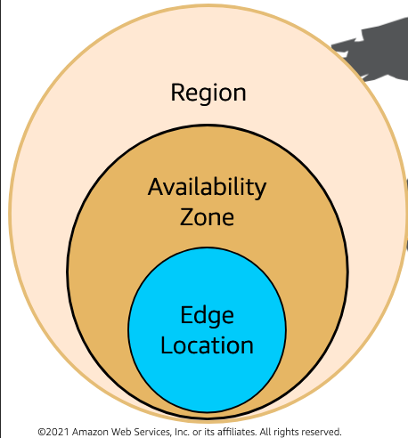
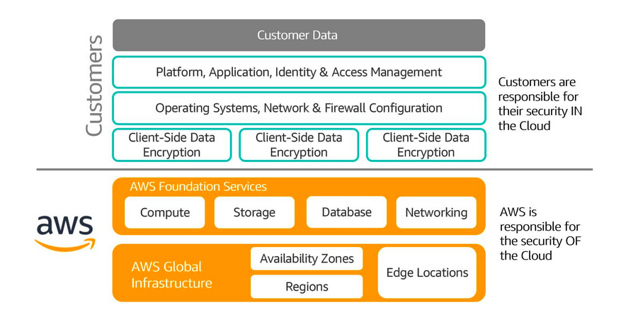
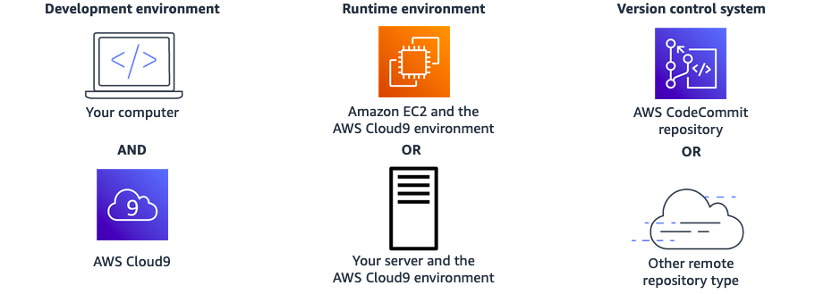

### Module1:

#### Definition:
Cloud computing is on-demand delivery of IT services over the internet on pay as you go basis.
#### Why cloud computing is needed?
Cloud computing treats IT assets as programmatic resources that can be torn up and set up.Provides dynamic and flexible arrangement for customers to meet their needs. More importantly cloud computing offers Pay-As-you-go feature to test and use the system.

#### Client-Server model
Client can be a web browser or a desktop which the users interact with. They ask for resources from the Server.
Server in modern computing is Amazon EC2 virtual servers.

#### Benefits of cloud computing
1. variable expense for upfront expense
2. No manual setting up of data center. Reduction of upfront cost.
3. Global in minutes
upfront expense is the wealth you normally spend on data  center, physical servers while variable expense is the wealth you only for computing resources you consume.

#### Cloud computing service models
There are three cloud computing service models i.e IaaS, SaaS and SaaS.

IaaS: Infrastructure as a service typically provide access to  hardware and networking resources .for example Amazon EC2 , Amazon S3 are examples of Iaas.

PaaS: Platform as a service remove the overhead of managing the underlying infrastructure and remain centered on deployment and management of applications.
An example of PaaS is Amazon elastic BeanStalk.

SaaS: Software as a service is fully completed software product .The consumer of the cloud service user do not have to worry about the underlying infrastructure and hardware resources on play.

#### Cloud Computing Deployment Models
There are three types of cloud deployment models namely Public cloud, Private cloud and Hybrid cloud. 

Public cloud: on public cloud models users can either migrate their applications to cloud or you can design and build own applications using the cloud computing resources and infrastructures.

Private cloud: private cloud or the on-premise cloud requires that the infrastructures like data centers, networking components are established locally.

Hybrid cloud: Hybrid cloud requires that the consumer uses both the properties of public and private cloud. This can offer greater advantages in terms of security, flexibility and availability.

### Module2:
AWS offers broad set of 175 global cloud based  services which include databases, compute, Storage, analytics, developer tools, business applications, management tools, machine learning, internet of things and security. 

#### AWS Services
Compute: EC2, Lambda, Elastic Beanstalk.
Storage: EFS, S3.
Database: RDS, DynamoDB.
Analytics: Athena, Amazon Redshift.
Networking and content delivery: VPC, CloudFront, Route53.
Developer tools: codestar, codecommit, codedeploy, codeartifact.
Management and Governance: cloudwatch, cloudformation, cloudtrail. 
Machine learning: Amazon sagemaker, Amazon codeguru, Amazon devopsguru.
Internet of Things: IoT core, IoT Analytics.
Business applications: Amazon pinpoint, Amazon connect.
Security Identity and compliance: IAM, Resource Access Manager, Cognito, GuardDuty, Inspector.

#### AWS Cloud Global Infrastructure:
The main components of the AWS Global Infrastructure are Regions, EdgeLocations, Availability Zones.

AWS has the concept of Region which is the physical location around the world where the data centers are clustered together. A group of logical data centers is called Availability zone.
An Availability zone is a region in a zoned area that can harbor one or more data centers.Availability zones are interconnected by low latency networking to provide replication.
Demo Examples:
Region: South America(sau paulo) 3AZ.
Region: Asia pacific Mumbai 3AZ.

##### How AWS global infrastructure can be used to plan for failure.
In terms of storage, compute and database.
Whenever a file is stored in Amazon S3, the file is redundantly copied to every availability zones in that region. If one fails we still have two other options.
Always spread out computing resources to multiple availability zones to guarantee high availability.
similar for database. Make multiple copies on multiple AZs.

#### AWS Global Infrastructure benefits:
The benefits offered are performance, availability, Security, Reliability, Scalability and low cost.
performance : provides high performing low latency cloud infrastructure with virtually unlimited capacity.
Availability Zones: provides physical redundancy and to provide resilience.
Security: Infrastructure is monitored 24/7 to help ensure CIA.

#### AWS shared responsibility:
It is a security model that is used to protect cloud infrastructures. Shared responsibility model is further divided into two parts. Cloud provider or AWS is responsible for security in the cloud and the customers are responsible for security in the cloud.

Above figure entails that customers are responsible for firewall , OS and network configuration , client-side data encryption and platform, application and identity and access management.
Moreover AWS is responsible for compute, storage, Database, Networking protection and AZ , Region, and edge locations protection.

#### Example of shared responsibility model:
Sanim stores a file to the Amazon S3 bucket. Sanim is hereby responsible for maintaining who can access, modify and revoke the file.Encryption of the data is also part of his job.
The protection of file services like S3 bucket and databases falls under the AWS job.

#### AWS well architected framework.
After reviewing thousands of architectures, AWS developed the well architected framework which is used to build the most resilient, high performing, cost effective infrastructure on the cloud.
The five pillars of the AWS well architected framework are :-
1. operational excellence
2. security
3. reliability
4. performance efficiency
5. cost optimization.

Operational excellence:
It is the ability  to run and monitor the system.Tasks include annotating documentation, making small reversible changes.

Security:
Ability to protect information, assets and systems

Reliability:
Ability to recover from disruptions, automatically recovering from failures, testing recovery procedures.

performance efficiency:
Ability to use computing resources efficiently. Experimenting more often, using serverless architectures and designing system to be global in minutes.

Cost optimization:
deliver services at the lowest possible cost.
#### Costing and billing
Total cost of ownership (TCO) is the financial metric that is used to estimate and compare  direct and indirect costs of product or service.
it includes:
1. Procurement
2. Management
3. Maintenance
4. Decommissioning of hardware resources

##### AWS Pricing models:
1. Pay as you go
2. Save when you reserve
3. Pay less by using more

#### AWS core services

##### AWS cloud9
It is a cloud based IDE that helps to write code, debug  and run it on browser. It comes prepackaged with popular programming languages like JS, Python, PHP.

Benefits of cloud9
1. code collaboratively : Instead of pushing to git and observer and test changes , the peers can work together in real time to write and check code.
2. Build serverless applications

 How cloud9 works
 
 

#### VPC

With Amazon Virtual Private Cloud (Amazon VPC), you can launch AWS resources in a logically isolated virtual network that you've defined.
A VPC is a  secure isolated private cloud located within public cloud. 

Imagine a public cloud as a crowded restaurant, and a virtual private cloud as a reserved table in that crowded restaurant.

