### _NMAP scripting engine_

to learn about the nmap scripting engine follow this link ( [https://nmap.org/book/nse-usage.html](https://nmap.org/book/nse-usage.html))

The **N**map **S**cripting **E**ngine (NSE) is an incredibly powerful addition to Nmap, extending its functionality quite considerably. NSE Scripts are written in the _Lua_ programming language, and can be used to do a variety of things: from scanning for vulnerabilities, to automating exploits for them. The NSE is particularly useful for reconnaissance, however, it is well worth bearing in mind how extensive the script library is.

There are many categories available. Some useful categories include:

- `safe`:- Won't affect the target
    
- `intrusive`:- Not safe: likely to affect the target
    
- `vuln`:- Scan for vulnerabilities
    
- `exploit`:- Attempt to exploit a vulnerability
    
- `auth`:- Attempt to bypass authentication for running services (e.g. Log into an FTP server anonymously)
    
- `brute`:- Attempt to bruteforce credentials for running services
    
- `discovery`:- Attempt to query running services for further information about the network (e.g. query an SNMP server).
    

  

working with nmap scripting engine ( nse )

 we looked very briefly at the `--script` switch for activating NSE scripts from the `vuln` category using `--script=vuln`. It should come as no surprise that the other categories work in exactly the same way. If the command `--script=safe` is run, then any applicable safe scripts will be run against the target (Note: only scripts which target an active service will be activated).

---

To run a specific script, we would use `--script=<script-name>`  , e.g. `--script=http-fileupload-exploiter`.

Multiple scripts can be run simultaneously in this fashion by separating them by a comma. For example: `--script=smb-enum-users,smb-enum-shares`.

  

Some scripts require arguments (for example, credentials, if they're exploiting an authenticated vulnerability). These can be given with the `--script-args`Nmap switch. An example of this would be with the `http-put` script (used to upload files using the PUT method). This takes two arguments: the URL to upload the file to, and the file's location on disk.  For example:

  

`nmap -p 80 --script http-put --script-args http-put.url='/dav/shell.php',http-put.file='./shell.php'`

  

Note that the arguments are separated by commas, and connected to the corresponding script with periods (i.e.  `<script-name>.<argument>`).

  

A full list of scripts and their corresponding arguments (along with example use cases) can be found [here](https://nmap.org/nsedoc/).

  

---

Nmap scripts come with built-in help menus, which can be accessed using `nmap --script-help <script-name>`. This tends not to be as extensive as in the link given above, however, it can still be useful when working locally.

### _HOW TO FIND THE NSE ( NMAP SCRIPTS)_

Ok, so we know how to use the scripts in Nmap, but we don't yet know how to _find_ these scripts.

  

We have two options for this, which should ideally be used in conjunction with each other. The first is the page on the [Nmap website](https://nmap.org/nsedoc/) (mentioned in the previous task) which contains a list of all official scripts. The second is the local storage on your attacking machine. Nmap stores its scripts on Linux at `/usr/share/nmap/scripts`
  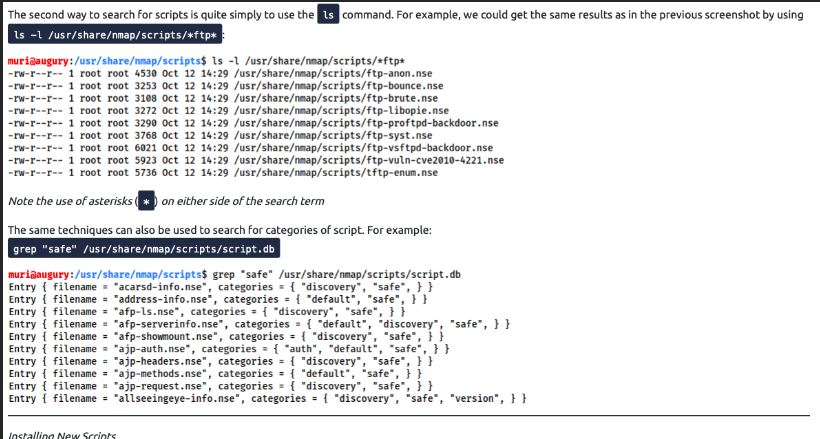
  

  

  
types of scan learned on nmap

  

1. tcp connect ->>> sT
    
2. udp scan ->>>> sU
    
3. null scan ->>> sN
    
4. fin scan ---->>> sF
    
5. xmas scan ----->>> sX
    
6. tcp ack scan ----->>> sA
    
7. tcp  window scan ---->>>sW

---

### _TCP CUSTOM SCAN_

### Custom Scan

If you want to experiment with a new TCP flag combination beyond the built-in TCP scan types, you can do so using `--scanflags`. For instance, if you want to set SYN, RST, and FIN simultaneously, you can do so using `--scanflags RSTSYNFIN`. As shown in the figure below, if you develop your custom scan, you need to know how the different ports will behave to interpret the results in different scenarios correctly.

spoofing and decoying

to spoof the ip address

1.nmap -S spoofing _ip  destination ip address

2 to make the destination unable to find the attacker ip address decoying ip address is used just to make it seem like it's not comign from the attacker

decoying method

 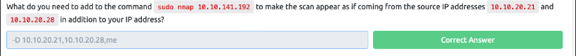 

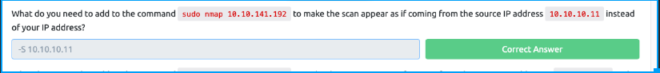

fragmented packets

-f  switch in nmap indicates that the tcp header is fragmented by 8 -ff indicates fragmented by 16

and so on

idle zombie scan

Spoofing the source IP address can be a great approach to scanning stealthily. However, spoofing will only work in specific network setups. It requires you to be in a position where you can monitor the traffic. Considering these limitations, spoofing your IP address can have little use; however, we can give it an upgrade with the idle scan.

  

The idle scan, or zombie scan, requires an idle system connected to the network that you can communicate with. Practically, Nmap will make each probe appear as if coming from the idle (zombie) host, then it will check for indicators whether the idle (zombie) host received any response to the spoofed probe. This is accomplished by checking the IP identification (IP ID) value in the IP header. You can run an idle scan using `nmap -sI ZOMBIE_IP` [10.10.141.192](http://10.10.141.192), where `ZOMBIE_IP` is the IP address of the idle host (zombie).

about --reason flag

Providing the `--reason` flag gives us the explicit reason why Nmap concluded that the system is up or a particular port is open. In this console output above, we can see that this system is considered online because Nmap “received arp-response.” On the other hand, we know that the SSH port is deemed to be open because Nmap received a “syn-ack” packet back.

If `-vv` does not satisfy your curiosity, you can use `-d` for debugging details or `-dd` for even more details. You can guarantee that using `-d` will create an output that extends beyond a single screen.

vvvvvviiii scanning

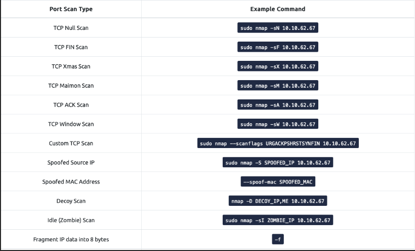

  

  
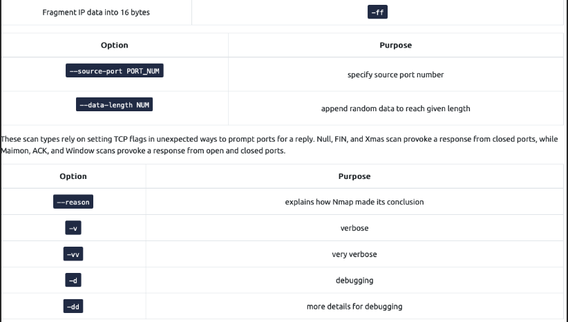

---
### _NMAP POST PORT SCANS

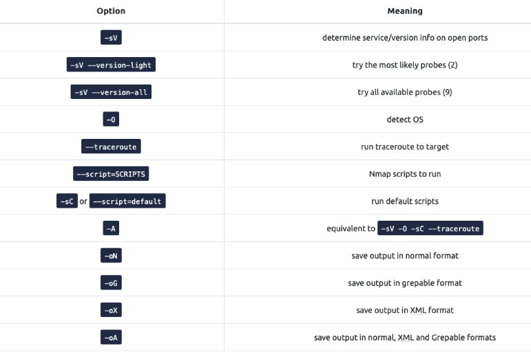

Once Nmap discovers open ports, you can probe the available port to detect the running service. Further investigation of open ports is an essential piece of information as the pentester can use it to learn if there are any known vulnerabilities of the service. Join [Vulnerabilities 101](https://tryhackme.com/room/vulnerabilities101) to learn more about searching for vulnerable services.

nmap scripting engine (nse)

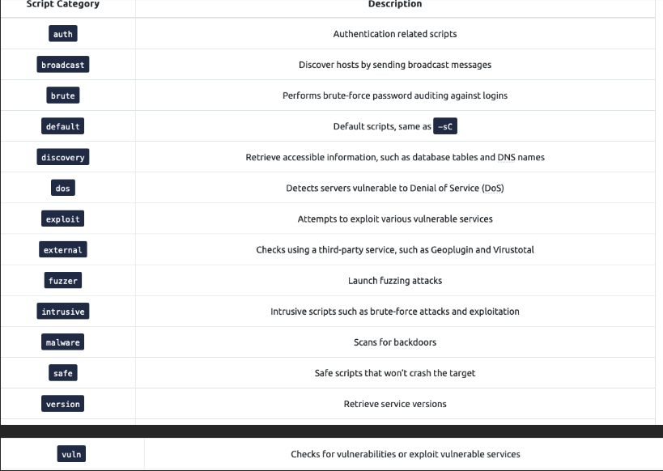

  

  

You can also specify the script by name using `--script "SCRIPT-NAME"` or a pattern such as `--script "ftp*"`, which would include `ftp-brute`. If you are unsure what a script does, you can open the script file with a text reader, such as `less`, or a text editor. In the case of `ftp-brute`, it states: “Performs brute force password auditing against FTP servers.” You have to be careful as some scripts are pretty intrusive. Moreover, some scripts might be for a specific server and, if chosen at random, will waste your time with no benefit. As usual, make sure that you are authorized to launch such tests on the target server.

  

Let’s consider a benign script, `http-date`, which we guess would retrieve the http server date and time, and this is indeed confirmed in its description: “Gets the date from HTTP-like services. Also, it prints how much the date differs from local time…” On the AttackBox, we execute`sudo nmap -sS -n --script "http-date"` [10.10.124.135](http://10.10.124.135) as shown in the console below.

  
---
### _PROTOCOLS AND SERVERS_

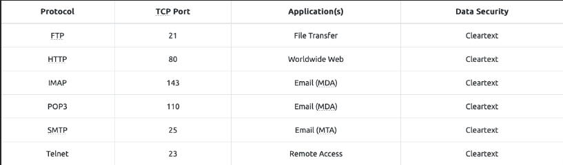

a bit about telnet from google

What do you mean by telnet?

Telnet is a network protocol used to virtually access a computer and to provide a two-way, collaborative and text-based communication channel between two machines. It follows a user command Transmission Control Protocol/Internet Protocol (TCP/IP) networking protocol for creating remote sessions.

HTTP(80)

HTTP sends and receives data as cleartext (not encrypted); therefore, you can use a simple tool, such as Telnet (or Netcat), to communicate with a web server and act as a “web browser”. The key difference is that you need to input the HTTP-related commands instead of the web browser doing that for you.

  

In the following example, we will see how we can request a page from a web server; moreover, we will discover the webserver version. To accomplish this, we will use the Telnet client. We chose it because Telnet is a simple protocol; furthermore, it uses cleartext for communication. We will use `telnet` instead of a web browser to request a file from the webserver. The steps will be as follows:

1. First, we connect to port 80 using `telnet` [10.10.58.4](http://10.10.58.4) `80`.
    
2. Next, we need to type `GET /index.html HTTP/1.1` to retrieve the page `index.html` or `GET / HTTP/1.1` to retrieve the default page.
    
3. Finally, you need to provide some value for the host like `host: telnet` and hit the Enter/Return key twice.
    

In the console output below, we could recover the requested page along with a trove of information not usually displayed by the web browser. If the page we requested is not found, we get error 404.

FTP  (21)

  

File Transfer Protocol (FTP) was developed to make the transfer of files between different computers with different systems efficient.

FTP also sends and receives data as cleartext; therefore, we can use Telnet (or Netcat) to communicate with an FTP server and act as an FTP client. In the example below, we carried out the following steps:

  

to connect :::

ftp machine_ip

telnet machine_ip 21.    however unable to download file using this command

pop3(110)

to connect :::

telnet ip_address 110 (for pop3)

The example below shows what a POP3 session would look like if conducted via a Telnet client. First, the user connects to the POP3 server at the POP3 default port 110. Authentication is required to access the email messages; the user authenticates by providing his username `USER frank` and password `PASS D2xc9CgD`. Using the command `STAT`, we get the reply `+OK 1 179`; based on [RFC 1939](https://datatracker.ietf.org/doc/html/rfc1939), a positive response to `STAT` has the format `+OK nn mm`, where _nn_ is the number of email messages in the inbox, and _mm_ is the size of the inbox in octets (byte). The command `LIST` provided a list of new messages on the server, and `RETR 1` retrieved the first message in the list. We don’t need to concern ourselves with memorizing these commands; however, it is helpful to strengthen our understanding of such protocol.

IMAP (143)

Internet Message Access Protocol (IMAP) is more sophisticated than POP3. IMAP makes it possible to keep your email synchronized across multiple devices (and mail clients). In other words, if you mark an email message as read when checking your email on your smartphone, the change will be saved on the IMAP server (MDA) and replicated on your laptop when you synchronize your inbox.

  

Let’s take a look at sample IMAP commands. In the console output below, we use Telnet to connect to the IMAP server’s default port, and then we authenticate using `LOGIN username password`. IMAP requires each command to be preceded by a random string to be able to track the reply. So we added `c1`, then `c2`, and so on. Then we listed our mail folders using `LIST "" "*"`, before checking if we have any new messages in the inbox using `EXAMINE INBOX`. We don’t need to memorize these commands; however, we are simply providing the example below to give a vivid image of what happens when the mail client communicates with an IMAP server.

TO CONNECT:::

telnet  machine_ip 143

---

### _PROTOCOLS AND SERVERS 2_

The [Protocols and Servers](https://tryhackme.com/room/protocolsandservers) room covered many protocols:

- Telnet
    
- HTTP
    
- FTP
    
- SMTP
    
- POP3
    
- IMAP
    

Servers implementing these protocols are subject to different kinds of attacks. To name a few, consider:

1. Sniffing Attack (Network Packet Capture)
    
2. Man-in-the-Middle (MITM) Attack
    
3. Password Attack (Authentication Attack)
    
4. Vulnerabilities
    

Any time you browse over HTTP, you are susceptible to a MITM attack, and the scary thing is that you cannot recognize it. Many tools would aid you in carrying out such an attack, such as [Ettercap](https://www.ettercap-project.org/) and [Bettercap](https://www.bettercap.org/).

ettercap (Ettercap is a comprehensive suite for man in the middle attacks. It features sniffing of live connections, content filtering on the fly and many other interesting tricks. It supports active and passive dissection of many protocols and includes many features for network and host analysis.)

  

bettercap ( The Swiss Army knife for [WiFi](https://www.bettercap.org/modules/wifi/), [Bluetooth Low Energy](https://www.bettercap.org/modules/ble/), wireless [HID hijacking](https://www.bettercap.org/modules/hid/) and [IPv4 and IPv6](https://www.bettercap.org/modules/ethernet) networks reconnaissance and MITM attacks.

  

Read the [project introduction](https://www.bettercap.org/intro/) to get an idea of what bettercap can do for you, [install](https://www.bettercap.org/installation/) it, [RTFM](https://www.bettercap.org/usage/) and start hacking all the things!!!

  

---

### _HOW TO FIND NMAP SCRIPTS:_

Ok, so we know how to use the scripts in Nmap,but we don't yet know how to _find_ these scripts.

We have two options for this, which should ideally be used in conjunction with each other. The first is the page on the [Nmap website](https://nmap.org/nsedoc/)  (mentioned in the previous task) which contains a list of all official  scripts. The second is the local storage on your attacking machine. Nmap  stores its scripts on Linux at `/usr/share/nmap/scripts`. All of the NSE scripts are stored in this directory by default -- this is where Nmap looks for scripts when you specify them.

There are two ways to search for installed scripts. One is by using the `/usr/share/nmap/scripts/script.db`  file. Despite the extension, this isn't actually a database so much as a  formatted text file containing filenames and categories for each  available script.

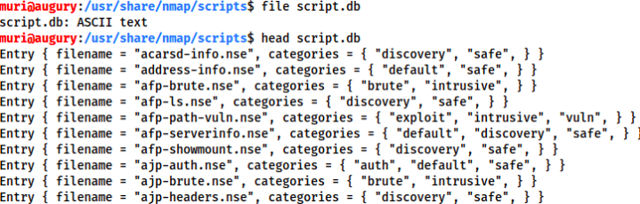

Nmap uses this file to keep track of (and utilise) scripts for the scripting engine; however, we can also _grep_ through it to look for scripts. For example: `grep "ftp" /usr/share/nmap/scripts/script.db`.

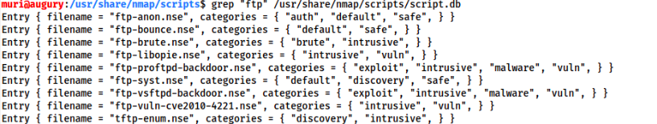

The second way to search for scripts is quite simply to use the `ls` command. For example, we could get the same results as in the previous screenshot by using `ls -l /usr/share/nmap/scripts/*ftp*`:

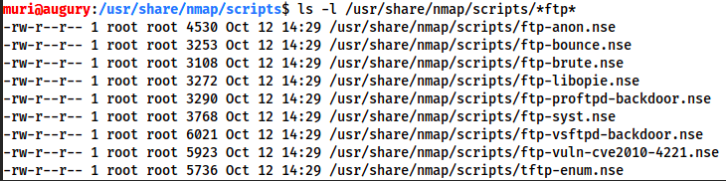

_Note the use of asterisks_ (`*`) _on either side of the search term_

The same techniques can also be used to search for categories of script. For example:`grep "safe" /usr/share/nmap/scripts/script.db`

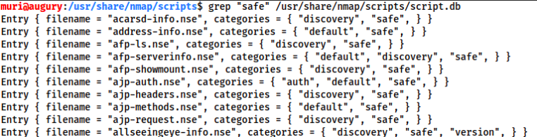

  

---

### _INSTALLING NEW SCRIPTS_

We mentioned previously that the Nmap website contains a list of scripts, so, what happens if one of these is missing in the `scripts` directory locally? A standard `sudo apt update && sudo apt install nmap` should fix this; however, it's also possible to install the scripts manually by downloading the script from Nmap (`sudo wget -O /usr/share/nmap/scripts/<script-name>.nse` [https://svn.nmap.org/nmap/scripts/](https://svn.nmap.org/nmap/scripts/)`<script-name>.nse`). This must then be followed up with `nmap --script-updatedb`, which updates the `script.db` file to contain the newly downloaded script.

It's  worth noting that you would require the same "updatedb" command if you  were to make your own NSE script and add it into Nmap -- a more than  manageable task with some basic knowledge of Lua!

## some *blue* text.