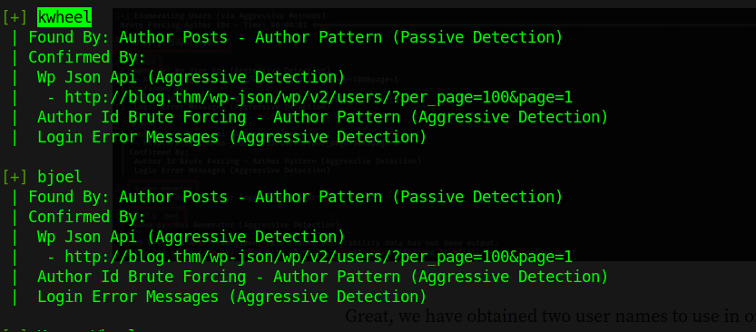
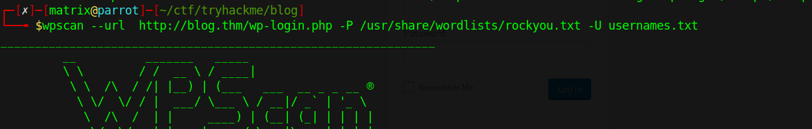
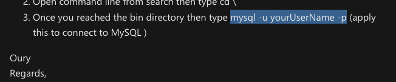

### emumeration:


user :BIlly
Karen Wheeler ----> mom


<https://wordpress.org/?v=5.0>

first running 
```
smbclient -L ipaddress
```


nothing valuable is found.just a rabbit hole

let's try the wordpress enumeration:

found the users:


trying to bruteforce login credentials 



submitting the credential to wp-login.php

we get file upload option on media however it only accepts image file jpg , png
trying all the possibilities like revshell.jpg.php and even changing the magic bytes of the file .However no results was obtained 

since we have enumerated the version of the wordpress cms to 5.0 looking for the vulnerability we get tampered image file upload vulnerability and google and exploit-db continuously shows crop image rce  which is exploitable in meetasploit as well. so going for it :-


we got the meterpreter shell :-

catting the user.txt gives :-

using meterpreter i downloaded the firing letter of billy joel but couldnot get anything
i tried exploit suggester.sh too but still couldnot find one
however using linpeas.sh i found the checker with suid enabled

finally:
catting the wp-config.php we get 


searching how to use mysql on commandline found this :-



got the password hash:


bjoel hash:   \$P\$BjoFHe8zIyjnQe/CBvaltzzC6ckPcO/
kwheel hash:  \$P\$BedNwvQ29vr1TPd80CDl6WnHyjr8te.

which was just a rabbit hole since bjoel hash didnot crack however kwheel hash password came out to be cutiepie1 as before

now i ran the linpeas and found the /usr/sbin/checker
executing it gave following result: **not an admin**
i did everything to exploit but couldnot so i eventually took help from walkthrough and found the on using ltrace command the admin is set from environment 

changing the admin by export admin=randomname and running the /usr/sbin/checker gave the root shell
