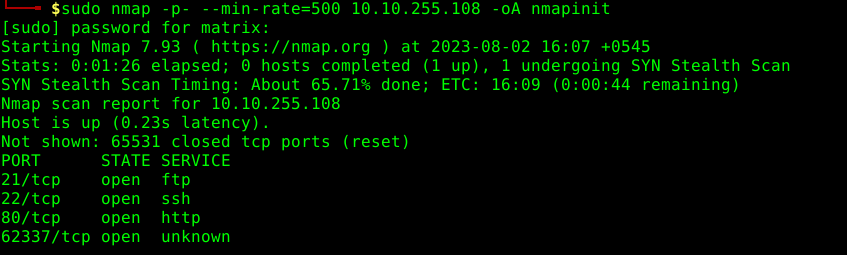
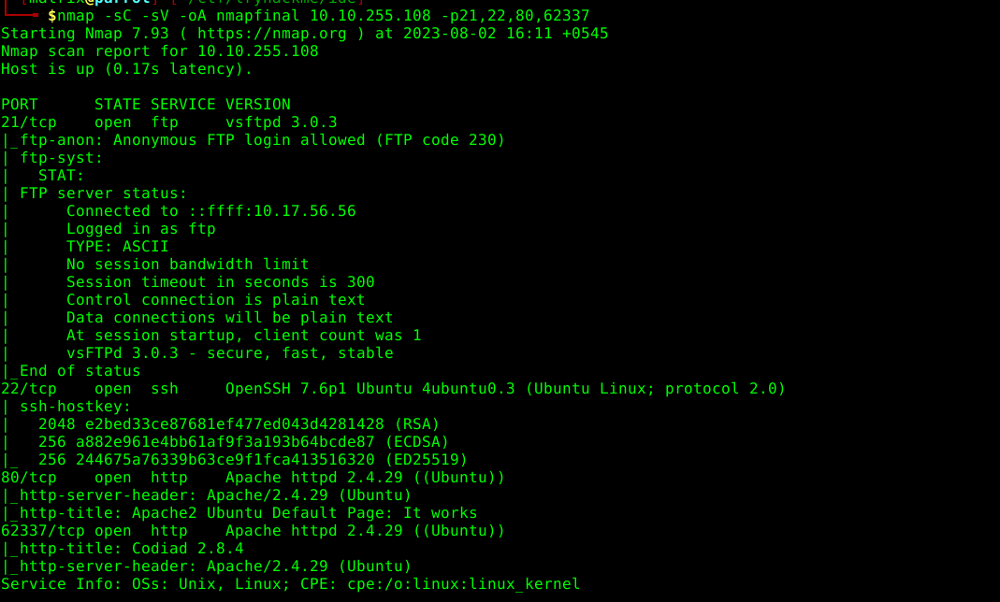
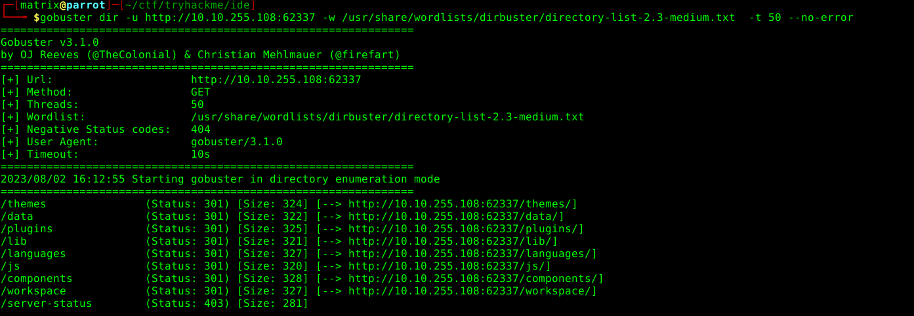
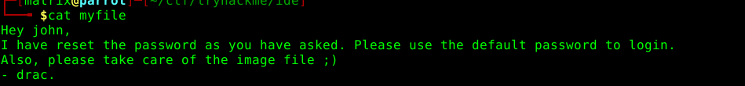
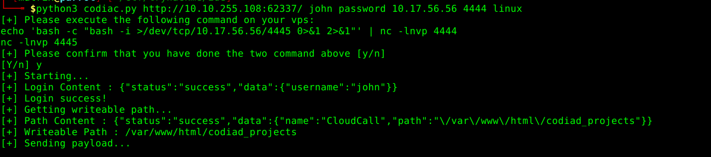
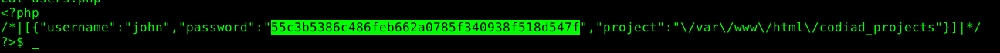
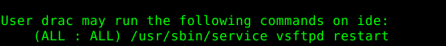

It is an easy rated machine on tryhackme.

NMAP port scan:

it shows anonymous ftp login allowed
and ssh enable now running **gobuster** on port 80

gobuster doesnot show any result however the server is running on the port 62337 as well now gobustering on this port
now checking the site on the browser gives a codiac 2.8.4 and a quick search on exploit-db gives that it has rce vulnerability however it requires the username and password.

we are prompted to enter username and password on the website
now trying the ftp since anonymous login is enabled
cd ... give a - file
getting the file and catting it gives the result:

now running the name john and default cred password we have sucessfully logged int now trying the found out exploit:

exploitation:

john password sha1:55c3b5386c486feb662a0785f340938f518d547f

cracked password:5f4dcc3b5aa765d61d8327deb882cf99
however it was just a rabbit hole

found the password of drac on .bash_history file on drac directory:
mysql -u drac -p 'Th3dRaCULa1sR3aL'

su drac and entering the password we get to cat the file which gives the user.txt

02930d21a8eb009f6d26361b2d24a466

running the sudo -l comamnd shows

i located the vsftpd .service  file and changed the
exec command to execute since it was writable by drac

sudo /usr/chmod +s /bin/bash

restarted the vsftpd and also systemctl daemon reload

running the /bin/bash -p gives the root access

which gives the root flag 

